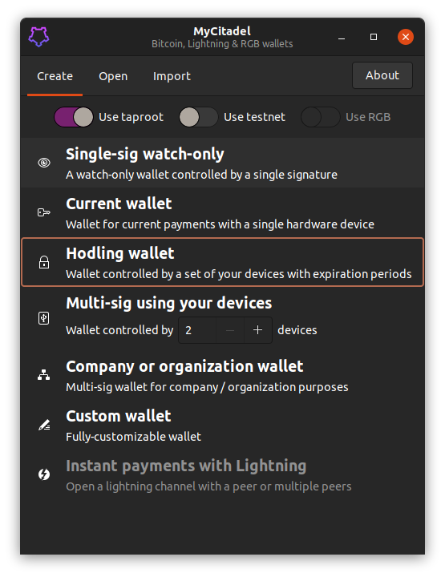
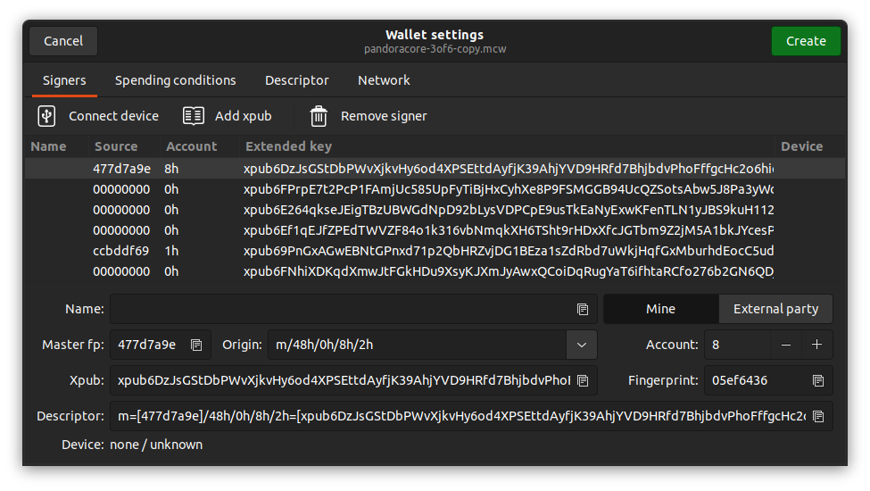
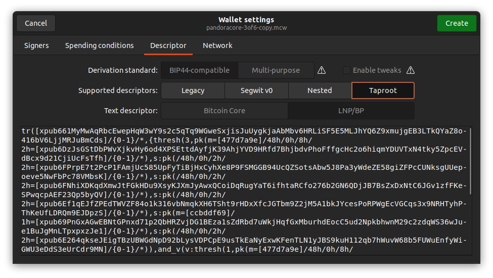
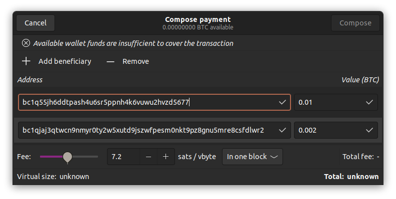

# MyCitadel Desktop

## Bitcoin, Lightning and RGB wallet

MyCitadel is a wallet for **bitcoin, digital assets and bitcoin finance 
(#BiFi) smart contracts**. It is blazingly fast, secure, cross-platform and 
technically most advanced wallet on the market, being the first wallet 
allowing taproot multisig and locktime-based spending conditions.

Do a reliable hodling (with inheritance options), corporate/organization, & 
current accounts - or instant Lightning payments. Work with single- and 
multisig setups, based on hardware, air-gaped, cold and server-side hot key 
storage, involving arbitrary complex time-lock scripts (with miniscript) and
wide interoperability (because of use of wallet descriptors). 

MyCitadel™ is a suite of software, hardware and Internet services focused on
digital individual sovereignty and privacy. It includes mobile &amp; desktop 
cross-platform wallets, web-of-trust contact &amp; identity management app,
end-to-end encrypted chat app, command-line tools, wallet runtime library and 
server-side node, which can be self-hosted, run on MyCitadel Box at home or in
private MyCitadel cloud.

The application is written with rust programming language, GTK+ framework and 
set of bitcoin &amp; lightning rust libraries developed by LNP/BP Standards 
Association, including client-side-validation, descriptor wallet, BP, LNP and 
RGB libraries. MyCitadel node also contains embedded LNP &amp; RGB Nodes 
provided by the Association.

# Key features

## Support of Taproot multisigs

Taproot-enabled from day one, including multisig- and script-based taproot.

## Air gapped, hardware and watch-only wallets

## Arbitrary complex spending conditions

## Wallet descriptors

## Batched payments

## Wallet-independent PSBT signer

# Installation

Please refer to the [INSTALL] document.

# License

This application is free software and distributed without any warranty under 
AGPL-3.0 License.

(C) 2022-23 Pandora Prime SA, Neuchatel, Switzerland. 
    Some rights are reserved; for details please read the license agreement.

For business, partnership and other enquiries please write to 
<enquiries@mycitadel.io>.

[INSTALL]: https://github.com/mycitadel/mycitadel-desktop/tree/master/doc/INSTALL.md
